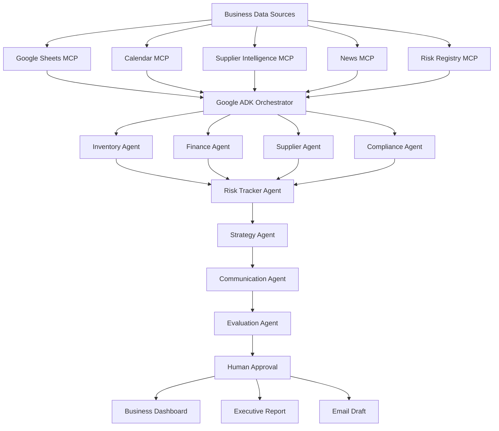

<div align="center">

# 🛡️ Business Guardian AI

### *Transforming Business Data into Intelligent Decisions*

#### **An Autonomous Multi-Agent AI Platform for Proactive Operational Risk Intelligence**

<p align="center">


</p>

---

### 🚀 **Your Business Doesn't Need More Data. It Needs Better Decisions.**

Business Guardian AI is an intelligent decision-support platform that transforms fragmented operational data into clear, explainable, and actionable business intelligence.

Instead of overwhelming business owners with spreadsheets and disconnected reports, the platform coordinates multiple AI agents that continuously monitor inventory, finances, suppliers, compliance obligations, and operational risks to recommend the next best course of action.

Designed around **Google ADK's multi-agent orchestration**, Business Guardian AI combines autonomous analysis with **Human-in-the-Loop (HITL)** approval, ensuring that critical recommendations remain transparent, explainable, and under human control.

### ⭐ Predict Earlier • Decide Smarter • Grow Faster ⭐

</div>

---

# 📸 Dashboard Preview

## 🏠 Business Overview Dashboard


The central dashboard provides an at-a-glance view of overall business health, operational status, current risks, and AI-generated recommendations, allowing business owners to understand their organization's condition within seconds.

---

## 📊 Business Health Analysis


The platform continuously evaluates operational performance and produces a unified **Business Health Score**, helping users prioritize attention where it matters most.

---

## 🚨 Operational Risk Intelligence


Risk assessments are automatically generated by combining insights from multiple AI agents, providing a consolidated view of inventory, supplier, financial, and compliance risks.

---

## 📈 Executive Reports


Business Guardian AI automatically prepares executive-ready summaries, strategic recommendations, and communication drafts that can be reviewed before distribution.

---

# 🎥 Project Demonstration

A complete walkthrough of Business Guardian AI, including system architecture, dashboard functionality, AI workflow, and live risk analysis.

**▶️ Demo Video**

```
[https://youtu.be/YOUR_VIDEO_LINK](https://youtu.be/7lRSV4bhjNs?si=Sz5_z4ao-4SL09kq)
```

---

# 📑 Presentation

Our complete hackathon presentation explaining the problem, solution, architecture, implementation, and future roadmap.

**📄 Presentation Slides**

```
https://canva.link/89r5o0wtxf0as4u
```

---

# 🌍 The Challenge

Modern businesses struggle with fragmented operational data (inventory, sales, expenses, and deadlines) trapped in disconnected silos. As a business grows, decision-making becomes reactive: stockouts occur before reorders are placed, supplier delays disrupt operations unexpectedly, and missed compliance deadlines trigger penalties. While traditional dashboards visualize history, they do not answer the critical questions:
- **What problem should I prioritize first?**
- **What is likely to go wrong next?**
- **What is the expected business impact?**
- **Can I trust these recommendations?**

---

# 💡 Our Solution

Business Guardian AI uses **Google ADK** to coordinate specialized, collaborative AI agents that monitor inventory, finances, suppliers, and compliance. By integrating data via **Model Context Protocol (MCP)**, the platform replaces opaque, monolithic models with modular, domain-specific intelligence. Recommendations are validated, confidence-scored, and presented with clear explanations, while ensuring critical communications remain subject to **Human-in-the-Loop (HITL)** approval.

---

# ✨ Key Highlights

* 🤖 **Multi-Agent Orchestration**: 8 specialized agents collaborate via a coordinated Google ADK pipeline.
* ⚡ **Parallel Processing**: Independent domain analyses run concurrently for speed and scalability.
* 📊 **Unified Health Score**: Operational data is consolidated into a single business health metric.
* 📦 **Domain Intelligence**: Deep automated reviews of Inventory, Finances, Suppliers, and Compliance.
* 🎯 **Strategic Prioritization**: Action items classified by urgency, expected business impact, and confidence.
* 👨‍💼 **Human-in-the-Loop**: Safeguards external communications by requiring manual review and approval.
* 🛡️ **Secure by Design**: Prompt sanitization, validation guardrails, audit logs, and explainable AI outputs.

---

# 🧠 Meet the AI Executive Team

Business Guardian AI is powered by a collaborative team of specialized AI agents. Instead of asking one large model to solve every problem, each agent focuses on a single business domain before contributing its findings to a centralized decision-making pipeline.

| 🤖 Agent | 🎯 Responsibility |
|----------|------------------|
| 📦 Inventory Agent | Detects inventory shortages, stock risks, and demand trends. |
| 💰 Finance Agent | Evaluates revenue, expenses, profitability, and financial stability. |
| 🤝 Supplier Agent | Monitors supplier performance, reliability, and external intelligence. |
| 📅 Compliance Agent | Tracks regulatory obligations, compliance deadlines, and calendar events. |
| 🚨 Risk Tracker Agent | Aggregates domain-specific risks into a unified operational risk profile. |
| 🎯 Strategy Agent | Prioritizes actions based on urgency, impact, and confidence. |
| 📢 Communication Agent | Generates executive briefings, reports, and approval-ready communications. |
| ✅ Evaluation Agent | Validates outputs, assigns confidence scores, and performs quality assurance. |

Each agent operates independently while contributing to a coordinated workflow orchestrated through **Google ADK**, enabling scalable, modular, and explainable AI collaboration.

---

# 🏗️ System Architecture



---

# 🔄 End-to-End Workflow

1. **Data Collection**: Fetch business records and news dynamically via MCP servers.
2. **Domain Analysis**: Google ADK launches specialized agents in parallel to assess domain risks.
3. **Risk Aggregation**: Risk Tracker Agent builds a consolidated operational risk profile.
4. **Strategic Prioritization**: Strategy Agent ranks action recommendations by urgency and impact.
5. **Executive Briefing**: Communication Agent drafts reports and emails for stakeholders.
6. **Validation**: Evaluation Agent audits outputs, ensuring quality and assigning confidence scores.
7. **HITL Gate**: System pauses for manual review and approval before final release.

---

# 🔌 MCP Integration Layer

Business Guardian AI extends beyond local business data by integrating multiple Model Context Protocol (MCP) services that enrich operational intelligence with contextual information.

| MCP Service | Purpose |
|-------------|---------|
| 📊 Google Sheets MCP | Inventory, sales, expenses, and supplier datasets |
| 📅 Google Calendar MCP | Compliance schedules and operational events |
| 📰 News MCP | Industry trends and supplier-related news |
| 🤝 Supplier Intelligence MCP | Supplier performance history and reliability |
| 🛡️ Risk Registry MCP | Historical operational risks and trend analysis |

These integrations allow the platform to make decisions using both internal business records and relevant external context.

---

# ⚙️ Technology Stack

## Artificial Intelligence

- Google ADK
- Google Gemini
- Multi-Agent Architecture
- Human-in-the-Loop (HITL)

---

## Backend

- Python
- FastAPI
- SQLite
- AsyncIO
- Pydantic

---

## Frontend

- React
- Vite
- TypeScript
- Tailwind CSS

---

## External Integrations

- Google Sheets
- Google Calendar
- MCP Services

---

## Security

- Prompt Injection Protection
- Validation Guardrails
- Audit Logging
- Confidence Scoring
- Explainable AI
- Role-Based Approval Workflow

---

# 📂 Project Structure

```text
business_guardian_ai/

├── agents/
│   ├── inventory_agent.py
│   ├── finance_agent.py
│   ├── supplier_agent.py
│   ├── compliance_agent.py
│   ├── risk_tracker_agent.py
│   ├── strategy_agent.py
│   ├── communication_agent.py
│   └── evaluation_agent.py
│
├── orchestrator/
│   ├── orchestrator.py           # Core execution engine
│   ├── state_manager.py          # Shared context and memory state
│   └── workflow.py               # Google ADK graph and pipeline definitions
│
├── mcp_servers/
│   ├── sheets_mcp.py
│   ├── calendar_mcp.py
│   ├── news_mcp.py
│   ├── supplier_intelligence_mcp.py
│   └── risk_registry_mcp.py
│
├── frontend/
│   ├── src/
│   └── public/
│
├── database/
├── guardrails/
├── docs/
├── tests/
├── main.py
└── README.md
```

---

# 💎 Why Our Architecture?

Rather than depending on a single AI model to interpret every business scenario, Business Guardian AI distributes responsibility across domain-specialized agents coordinated by Google ADK. This modular architecture improves explainability, scalability, maintainability, and resilience. Each recommendation can be traced back to the agent that produced it, making the platform easier to audit, debug, and extend as business requirements evolve.

---

# 🚀 Getting Started

Follow the steps below to run Business Guardian AI locally on your machine.

---

## 1️⃣ Quick Start: One-Click Launch in VS Code (Recommended)

1. Open this project folder in **VS Code**.
2. Press **`Ctrl + Shift + B`** (or go to the top menu: **Terminal** ➜ **Run Build Task...**).
3. VS Code will automatically start:
   * **FastAPI Backend**: [http://localhost:8000/](http://localhost:8000/)
   * **Vite React Frontend**: [http://localhost:5173/](http://localhost:5173/)
4. Open your browser and navigate to **[http://localhost:5173/](http://localhost:5173/)**.

---

## 2️⃣ Manual Setup

### 🐍 Backend Setup (Root Directory)
1. Open a terminal in the project root directory:
   ```bash
   python -m venv .venv
   ```
2. Activate the virtual environment:
   * **Windows**: `.venv\Scripts\activate`
   * **macOS / Linux**: `source .venv/bin/activate`
3. Install dependencies:
   ```bash
   pip install -r requirements.txt
   ```
4. Create a `.env` file in the root directory (based on `.env.example`) and add your Gemini API Key:
   ```env
   GOOGLE_API_KEY=your_gemini_api_key_here
   ```
5. Start the backend:
   ```bash
   uvicorn main:app --port 8000
   ```

### 🎨 Frontend Setup
1. Open a second terminal and navigate to the frontend folder:
   ```bash
   cd frontend
   ```
2. Install dependencies:
   ```bash
   npm install
   ```
3. Start the dev server:
   ```bash
   npm run dev
   ```
4. Open **[http://localhost:5173/](http://localhost:5173/)** in your browser.

---

# 🔗 API Overview

| Method | Endpoint | Description |
|---------|----------|-------------|
| GET | `/` | Root styled dark-mode welcome page |
| GET | `/history` | Query risk score trends (grouped by run_id) |
| POST | `/analyze` | Execute the multi-agent AI analysis pipeline |
| GET | `/reports` | Retrieve stored full analysis reports |
| POST | `/analyze/approve` | Submit Human-in-the-Loop review approvals |


---

# 🛡️ Security & Responsible AI

* **Human-in-the-Loop**: External communications require manual review and approval before distribution.
* **Prompt Injection Protection**: Sanitizes all inputs from MCP data sources before analysis.
* **Explainable AI**: Every recommendation includes supporting evidence and rationale.
* **Confidence Scores**: Rated by the Evaluation Agent to denote reliability.
* **System Traceability**: Complete audit logging of agent events, validations, and approvals.

---

# 📈 Future Roadmap

Although Business Guardian AI already delivers comprehensive operational intelligence, we envision several exciting enhancements:

- 📊 Real-time streaming analytics
- 📱 Native Android and iOS applications
- ☁️ Cloud-native deployment with Kubernetes
- 🔔 Instant notifications and alerting
- 📉 Advanced predictive forecasting models
- 🌍 Multi-language support
- 🤖 Voice-enabled AI business assistant
- 📑 Automated PDF report generation
- 🔗 ERP and CRM integrations
- 📡 Live IoT sensor integration for operational monitoring

---

# 👥 Team

| Name | Role |
|------|------|
| Pushkar | Team Lead, orchestration, backend architecture, and Guardrails |
| Alina | Data models, MCP layer integration and data integration  |
| Riyanshika | AI agent developer, Google ADK workflow design and debugging  |
| Yash | Frontend Developer, Skills implementor and UI/UX designer |

---

# 🏆 Hackathon Highlights

✅ Google ADK Multi-Agent Orchestration

✅ Google Gemini AI Integration

✅ Model Context Protocol (MCP)

✅ FastAPI Backend

✅ React + Vite Frontend

✅ SQLite Database

✅ Human-in-the-Loop Approval Workflow

✅ Explainable AI

✅ Operational Risk Intelligence

✅ Modular Multi-Agent Architecture

---

# 🙏 Acknowledgements

We would like to thank the hackathon organizers, mentors, and the open-source community for providing the tools and inspiration that made this project possible.

Special appreciation goes to the teams behind:

- Google ADK
- Google Gemini
- FastAPI
- React
- Vite
- SQLite
- Python

Their technologies enabled us to build a practical AI solution focused on improving operational decision-making for modern businesses.

---

<div align="center">

# ⭐ If you found this project interesting, please consider giving it a Star!

### Business Guardian AI

**From Data → Intelligence → Decisions**

Built with ❤️ for innovation, responsible AI, and smarter businesses.

</div>
